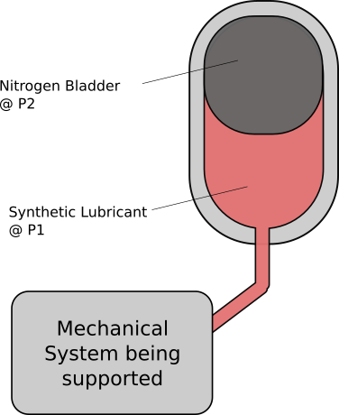

# RNN for Mechanical Systems

## Overview

Mechanical systems are monitored with a wide array of sensors to obtain information on performance and equipment health. Using this data in a machine learning application can be useful in many ways. rnnMechanicalSystems will use time series data to predict future performance of one of the specific features captured by sensors.

We'll hypothesize a bladder accumulator installed at a solar power plant in the high desert of Souther California (this is very practical). By monitoring the pump flow rate of the mechanical pump, ambient temperature and bladder pressure, we'll create a neural network to predict future values for pressure in the time series data.

By predicting performance of these types of systems, operators of the plant or equipment can optimize resources and minimize downtime when it comes to equipment failure and health monitoring.

## Documentation

There are two notebooks that contain details on the project. The first being exploration for the project and the second having documented details on the `main.py` file along with conclusive analysis of the model.

The final notebook is found [here](https://github.com/Yettimania/rnnMechSystem/blob/main/notebooks/.ipynb_checkpoints/2%20-%20Recurrent%20Neural%20Networks%20for%20Sensor%20Data%20in%20Mechanical%20Systems%20FINAL-checkpoint.ipynb)

## File Structure

`data` - Contains the raw data, typically a CSV file which was generated from Notebook 1

`figs` - Directory for storing graphics of raw data, model loss, predictions, etc.

`notebooks` - Jupyter notebooks used for data exploration and documentation.

`src` - Developed libraries used within the `main.py` script. Contains
1. `data` - Functions for preprocessing raw data
2. `model` - Tensorflow model objects that can be defined and imported to `main.py`
3. `visualization` - Functions to generate graphics using `matplotlib` library
4. `windowdata` - Class definition to develop timeseries windows and batches. Used to split the data input **input* and *labels*.

## main.py
Main script to develop neural networks for time series data. Usage of the `main.py` is commented within the file but follows order of operation:

1. Import libraries
2. Import csv data to dataframe
3. Split the the dataframe into training and validation
4. Normalize the dataframes
5. Develop windowed data with *inputs* and *labels*
6. Import defined models in `src/model.py`
7. Plot performance and prediction data

# Dependencies
The `requirements.txt` file has the appropriate python libraries for a virtual environment. They include:

- Pandas
- matplotlib
- numpy
- tensorflow
